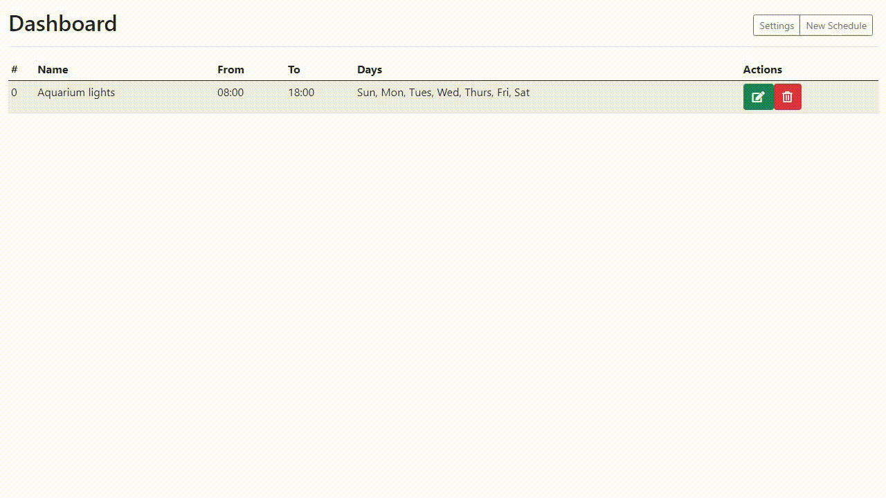
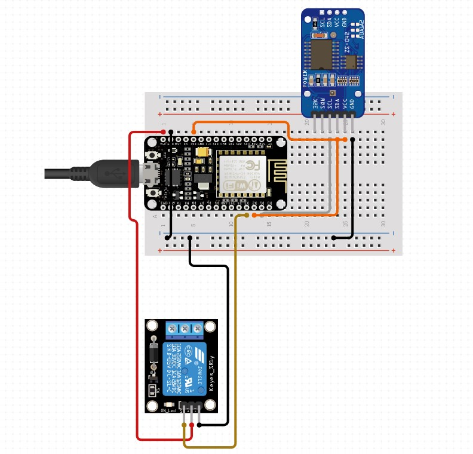

<h1 align="center">
  Esp Rtc Timer
</h1>
<h4 align = "center">
  Digital timer build with ESP8266 Microcontroller and friendly web interface.
</h4>
<p align="center">
  
  
  

  <a href="https://github.com/rafaelbds04/esp-rtc-timer/commits/master">
    
  </a>
  
  <a href="https://github.com/rafaelbds04/esp-rtc-timer/issues">
    
  </a>
  
  
</p>



# ⚡️ Key Features
* Uses Real Time Clock Module (RTC) instead of internal NTP *But in the future new update, they can work together
  - The application doesn't broke if you don't have internet connection. Using just a internal NTP you need internet connection to init the application.
* Can schedule different days of the week and multiple times
* Can use a name for each schedule
* Friendly setup and web interface
* Doesn't need the wifi connection to work. *Is only needed to configure schedules

# 🚀 Getting started

You'll need: 
  * ESP8266 Microcontroller
  * Board driver CP210x (NodeMCU V2 and ESP32) or CH340G (NodeMCU V3)
  * [PlatformIO Core](http://docs.platformio.org/page/core.html) (Command line tool) or [PlatformIO IDE for VSCode](https://platformio.org/install/ide?install=vscode) 
    - [Advanced usage](https://docs.platformio.org/en/latest/platforms/espressif8266.html?utm_source=arduino-esp8266) - custom settings, uploading to SPIFFS, Over-the-Air (OTA), staging version
    
```bash
# Clone this repository
$ git clone https://github.com/rafaelbds04/esp-rtc-timer.git

# Go into the repository
$ cd esp-rtc-timer

```

* Change board PINS connections inside `src/relay.h` and `src/rtc.h` (if you need).
* Configure name and password of wifi setup access point inside `src/wifi.h`

```bash
# Build project
$ platformio run

# Upload Filesystem Image (/data folder)
$ platformio run --target uploadfs

# Upload firmware
$ platformio run --target upload
```
* Connect the ESP to your local network
  * Login into generated access point
  * Select your wifi SSID and type your SSID password
* Now you have the ESP connected to your network!
  * Get ESP ip address from serial port or your router
  * Open ESP ip address into your web-browser
* You already can control the schedules! 🎉

## :electric_plug: Board connection example


# ⭐️ Contributing


1. Clone repo and create a new branch: `git checkout https://github.com/rafaelbds04/esp-rtc-timer.git -b <name_for_new_branch>`.
2. Send to origin branch: `git push origin esp-rtc-timer / <name_of_your_branch>`.
3. Submit Pull Request!

And not less importantly add a [GitHub Star](https://github.com/rafaelbds04/esp-rtc-timer) to this project! :D

# License
[MIT](https://github.com/rafaelbds04/esp-rtc-timer/blob/master/LICENSE.md)
